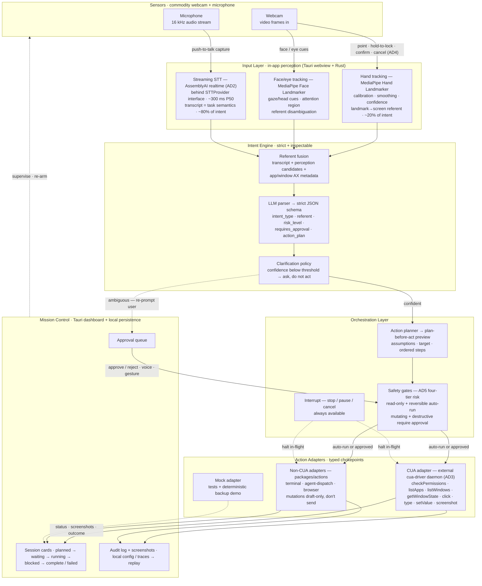

# Hands-Off — Project Planning Document

**A notarized macOS desktop mission-control app — select live desktop context through hand gesture plus face/eye tracking input, speak intent (primary semantics), turn the multimodal signal into a scoped agent task, execute it through a computer-use agent, and supervise the result through visible status, permissions, logs, and safety gates.**

> The product plan for Hands-Off — the problem, the technical approach, the scope, and who owns what.

- **Team:** Jason Dijols, Naama Paulemont, Hirom Alarcon, Alexander Gouyet (4 challengers)
- **Direction:** A — Combine classical ML/CV (MediaPipe hands plus face/eye tracking) with LLM applications (intent parsing + computer-use agent)
- **Date / version:** 2026-06-18 · v1.0
- **Deadline:** live demo Mon Jun 29 (D02)
- **Repos:** `HandsOff` (this repo — Tauri macOS app) · `HandsOff-Knowledge` (team research & decisions)

---

## 1. Executive Summary

AI engineers now run **many agents at once** — Claude Code, Codex, browser issues, terminals, docs — and the bottleneck has shifted from *producing* work to *supervising* it. One cursor, one focus, and constant context-switching to tell an agent what to act on and to approve or inspect what it did. **Hands-Off** is a **multimodal desktop control plane** for that supervision: **hand gesture plus face/eye tracking** selects live context (~20% of intent — the deictic referent), **speech** carries the command (~80% — the task semantics), and the app fuses them into a **scoped, schema-validated action plan**, shows it for approval, and executes it through a **computer-use agent (CUA)** or a **non-CUA adapter** (a terminal/agent task), surfacing status, logs, screenshots, and safety gates so you can supervise multiple tasks at once.

Voice carries task semantics; hand gesture plus face/eye tracking carries the referent that grounds "that," "this window," "the Codex run," and "the issue over there." The result is **scoped, inspectable, reversible** agent work.

**Demo success (Jun 29):** point at a GitHub issue and a Claude Code terminal, say *"use these to brief the coding agent,"* see the proposed task, approve it, watch CUA execute, and supervise the result — pausing, inspecting, approving, or rejecting by voice or gesture.

## 2. Problem

### The scenario

An AI engineer has a screen full of running agents: a Claude Code terminal mid-task, a Codex run, a browser on a GitHub issue, a doc, two more terminals. To move work forward they must repeatedly: find the right window, click into it, copy context from one surface to another, type or paste an instruction, then babysit the result. Every delegation and every check-in is a manual focus-and-cursor round-trip. The supervision overhead grows linearly with the number of agents — exactly the thing that was supposed to save time.

### Who & why it hurts

**ICP: AI engineers / heavy agent users** — people running Cursor, Claude Code, Codex, and custom agents all day. Their cost is twofold: the **one-cursor / one-focus interaction tax** (serial pointer, serial attention) and the **agent-supervision overhead** (selecting context for, dispatching, and inspecting many concurrent tasks). The medium that should let them run a fleet of agents in parallel forces them back into serial, manual operation.

### Why now / our wedge

Computer-use agents (CUA) finally **absorb the hard OS-action layer** — clicking, typing, reading window state across real apps — so the product focuses on the thing that matters: letting the user **understand, trust, and supervise** what the agents do. Meanwhile commodity webcams + MediaPipe + streaming STT make multimodal input cheap. Our wedge is **Put-That-There (Bolt, 1980) for agent supervision:** **point supplies the referent; voice supplies the intent; an LLM keeps the action bounded and inspectable** — a precise pointer for *where*, natural speech for *what*, and a visible, stoppable agent for the action.

## 3. Goals & Scope

**Floor (must work by demo day):**

1. A **signed/notarized macOS app** that launches from Finder and terminal with a clear first-run permissions flow (camera, microphone, CUA daemon, Accessibility, Screen Recording) shown as green/yellow/red readiness.
2. A **mission-control dashboard** showing readiness, agent **session cards** (planned, waiting-approval, running, blocked, complete, failed), approval queue, plan preview, and audit trail. The dashboard is supervision-only.
3. **Perception-to-select + speak** producing a **referent candidate with confidence** from hand gesture plus face/eye tracking, fused with the transcript into a **strict intent schema** and a **visible plan-before-act** preview.
4. **CUA execution** of approved plans through a typed adapter, with **tiered safety gates**, an **interrupt path** ("stop/pause"), live status, and an **audit trail** for replay.

> **Scope firewall rule:** every task must support the core loop — *select live context → speak intent → create scoped plan → approve → execute through CUA/agent → supervise result.* New gestures, command classes, STT providers, and target-app support are added through project-lead approval.

**Demo moment:** **"use these to brief the coding agent."** Select a GitHub issue and a Claude Code terminal with hand gesture plus face/eye tracking, speak it, approve the proposed task, and watch the dashboard show the action trail, assumptions, screenshots, and result — then "pause," "inspect," "approve," or "reject" by voice or gesture.

**Timeline:** desktop shell + readiness next · CUA adapter + intent loop mid-cycle · demo rehearsal Jun 28 · **live demo Mon Jun 29.**

## 4. Technical Approach

### Architecture

Six layers inside one Tauri desktop app: **Mission Control UI**, **Input Layer** (camera + MediaPipe hand/face/eye tracking + STT), **Intent Engine** (referent fusion + schema validation + clarification + safety classification), **Orchestration Layer** (action planner + approval gates + interrupt), **Action Adapters** (CUA + non-CUA + mock), and **Persistence/Telemetry** (config + audit + traces). Voice dominates (~80%); hand gesture plus face/eye tracking supplies the deictic referent (~20%).

> The diagram is annotated with the **what** (tech stack per layer) and the **how**
> (the user interaction and goal on each edge). Tech choices trace to the Stack table
> and ADRs (AD1–AD5) below.

**Core flow:** MediaPipe hand plus face/eye tracking produces referent candidates with confidence; streaming STT produces the transcript; the Intent Engine fuses **where + what** into a strict, machine-checkable schema with a `risk_level`; the Orchestration Layer renders a **plan-before-act** preview and gates it by risk; an approved plan executes through the **CUA adapter** (or a **non-CUA adapter** for tasks routed off the CUA path, e.g. spinning up a Codex terminal with bash access); the dashboard streams status, screenshots, assumptions, and an audit trail you can replay.

### Hard problems we're solving

- **Reference binding ("this / there")** — hand gesture plus face/eye tracking for target evidence, window metadata for grounding, voice for action; always preview before commit.
- **Voice-dominant fusion under uncertainty** — combine noisy modalities into one scoped intent + confidence; **clarify** below threshold before acting.
- **Safety on real desktop state** — CUA can mutate things; a four-tier risk policy gates mutating/destructive actions behind explicit approval (see AD5).
- **Target reliability** — prioritize AX-rich surfaces (browsers, terminals, IDE/Cursor/Codex terminals, text docs) and report every action's outcome so the user always sees what happened (see AD3).
- **Deliberate activation** — push-to-talk and dwell/hold gestures so the user explicitly arms every action; false-activation rate is a tracked metric.
- **Latency** — hosted streaming STT (~300 ms P50) and a local perception loop keep command-to-plan within budget.

### Architecture decisions (ADRs)

Recorded in full in `HandsOff-Knowledge/FINAL_Product Planning.md` (§ Architecture decisions) and tracked by `HandsOff-C5/HandsOff#14` under epic `#4`. Status: `proposed` (pending architecture review).

| ADR | Decision | Status |
| --- | --- | --- |
| **AD1 — App shell** | **Tauri** (Rust + web) — supervision UX is dashboard-heavy and ships fastest for a web-native team; CUA owns OS-action risk | proposed |
| **AD2 — STT provider** | **Hosted streaming (AssemblyAI realtime)** behind a provider-agnostic `STTProvider` interface, push-to-talk capture | proposed |
| **AD3 — CUA integration** | **External cua-driver behind a typed in-app adapter** (`checkPermissions, listApps, listWindows, getWindowState, click, type, setValue, screenshot`) | proposed |
| **AD4 — Gesture vocabulary** | **Minimal referent-selection set:** point/select, hold-to-lock, confirm, cancel, pause/stop; target selection stays in the perception layer | proposed |
| **AD5 — Safety / risk policy** | **Four tiers** (read-only · reversible · mutating · destructive/external) with **plan-before-act** and **tiered approval**; clarify on low confidence; always-available interrupt; full audit trail | proposed |

### Stack

| Layer | Choice | Why |
| --- | --- | --- |
| App shell | **Tauri** (Rust backend + web frontend) — AD1 | dashboard-heavy supervision UX ships fastest for a web-native team; CUA absorbs OS-action risk |
| Hand + face/eye tracking | **MediaPipe Hand Landmarker + Face Landmarker** | real-time landmarks from a commodity webcam; we add calibration, smoothing, confidence, and landmark/gaze/head cues → referent mapping |
| Speech / STT | **AssemblyAI realtime** (hosted streaming, ~300 ms P50) — AD2 | voice is ~80% of intent; hosted streaming hits the latency budget and keeps packaging and notarization simple |
| Intent engine | **Strict JSON schema + LLM parser + referent fusion** | machine-checkable, scoped, inspectable action plans |
| Safety | **4-tier risk + plan-before-act + tiered approval** — AD5 | CUA can mutate real state; mutating/destructive actions are gated and audited |
| CUA action | **External cua-driver behind a typed adapter** — AD3 | CUA owns OS-action complexity; the adapter is the single typed chokepoint for typing, retries, health/permission gating, and outcome reporting |
| Non-CUA actions | **Terminal / agent-dispatch / browser adapters** (`packages/actions`) | tasks routed off the CUA path (e.g. spin up a Codex terminal with bash access, dispatch a Claude Code/Codex task) |
| Supervision | **Session model + approval queue + audit trail** | supervise multiple concurrent agent tasks; replay the demo after the fact |
| Persistence | **Local config + audit events + traces** | first-run config, replayable trace, demo logs |
| Research & decisions | **`HandsOff-Knowledge` repo** | research digests + ADRs (AD1–AD5) |

## 5. Team & Ownership

One **accountable** owner per workstream, mapped to the `area:*` labels. ⚠️ Confirm assignments with the team before relying on this.

| Workstream (area) | Owner | Support | Done when |
| --- | --- | --- | --- |
| Project lead / delivery & demo | Naama | — | prioritized board + rehearsed demo path |
| Desktop host + readiness shell (`area:desktop`) | Naama | Hirom | app launches; readiness shows green/yellow/red for every capability |
| Hand / pointing input (`area:gesture`) | Jason | Hirom | stable point/select + hold-to-lock → referent candidate with confidence |
| Voice / STT (`area:stt`) | Naama | Alexander | reliable command text at demo latency, push-to-talk |
| Intent engine + fusion (`area:intent`) | Hirom | Jason, Alex, Naama | fused intent → schema-validated, previewed, bounded plan |
| CUA + non-CUA action layer (`area:cua`) | Hirom | Jason | approved plan executes, verifies, and reports every outcome |
| Agent supervision dashboard (`area:agent-supervision`) | Naama | Hirom | session cards, approval queue, audit log, results |
| Release / signing / notarization (`area:release`) | Hirom | Naama | clean machine installs and runs a notarized artifact |
| Market / positioning | Alexander | — | defensible why-now and why-us |

## 6. Deliverables & Definition of Done

**"Done" means Demo Verified.** Per the CI/CD rules in `HandsOff-Knowledge/docs/github-cicd.md`: merged to `main`, then the issue's "Test / demo proof" run from the built app.

| Deliverable | Requirement |
| --- | --- |
| Live presentation (10 min) | live *point + speak → plan → approve → CUA action → supervise* demo + learnings, Jun 29 |
| Downloadable macOS app | signed/notarized DMG/ZIP; a clean machine can install and run it |
| Code repo (`HandsOff`) | Tauri scaffold, area-owned packages, runnable demo, setup + permissions guide |
| Mission-control dashboard | readiness, session cards, plan preview, approval queue, audit log, and results |
| Knowledge graph / ADRs | research digests + AD1–AD5 recorded in `HandsOff-Knowledge` |
| Demo recording | session capture proving select → plan → approve → act → supervise |
| Backup demo mode | mocked CUA + mocked surfaces for a deterministic demo |

*Detailed research and the full ADR records live in `HandsOff-Knowledge`. Implementation tickets are tracked as GitHub issues under the milestones/epics (`#4`, `#5`, …).*
