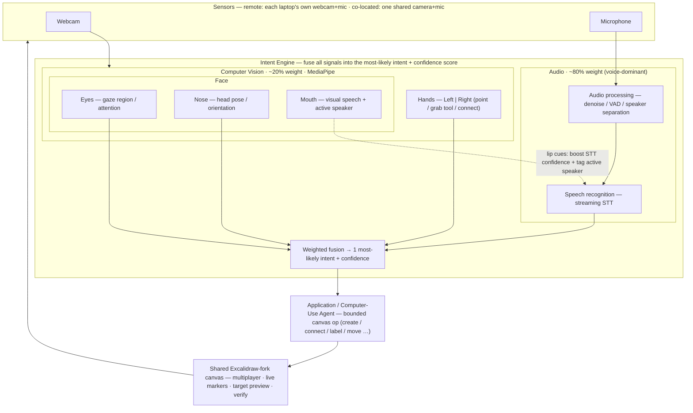

# Hands-Off — Project Planning Document

**A real-time, multimodal collaborative canvas — design systems together by speaking (primary), pointing/gesturing, and looking, on a forked, agent-aware Excalidraw.**

> **Deliverable 01 (D01)** for the Gauntlet AI capstone — our team's plan: the problem, the technical approach, the scope, and who owns what.

- **Team:** Jason Dijols, Naama Paulemont, Hirom Alarcon, Alexander Gouyet (4 challengers)
- **Direction:** A — Combine classical ML/CV with LLM applications
- **Date / version:** 2026-06-17 · v2.2
- **Deadline:** Wed Jun 17, 11:59 PM (D01) · live demo Mon Jun 29 (D02)
- **Repos:** `HandsOff` (this repo — fork of `excalidraw/excalidraw`) · `HandsOff-Knowledge` (team research & decisions)

---

## 1. Executive Summary

AI engineers align on systems by **drawing them together** — but digital canvases (FigJam, Miro, Excalidraw) funnel everyone through one mouse and keyboard, so co-creation collapses into slow turn-taking. **Hands-Off** gives each participant a mostly hands-free "digital marker": **talk** to the canvas while **pointing/gesturing** to say *where* and *which*, with face tracking (gaze, head pose, lip movement) sharpening both.

We fork **Excalidraw** and add an **Intent Engine** that fuses webcam + mic signals — **voice-dominant (~80%) over vision (~20%)** — into one bounded canvas operation with a confidence score and pre-commit preview, executed by an **application/computer-use agent**. Classical CV/ML (MediaPipe hands + face) and streaming STT (AssemblyAI, with lip cues boosting recognition) are the Direction-A pairing.

**Demo success (Jun 29):** two people on two machines co-build a labeled architecture diagram live — grab a tool by gesture, dictate node labels, connect elements by voice + point — seeing each other's markers in real time. **North-star stretch:** one camera, four co-located teammates, voice-separated so everyone drives the same canvas.

## 2. Problem

### The scenario

Two remote engineers open a shared canvas to design an auth service. Person A drives the mouse; Person B has ideas *now* but waits, narrates, or grabs control. What takes five seconds at a physical whiteboard — both reach in, both draw, both talk — takes minutes of polite turn-taking. The diagram lags the conversation and ends up as a static export nobody updates.

### Who & why it hurts

**ICP: AI engineers** using Cursor, Claude Code, Codex, and custom agents — people who constantly externalize system designs, agent flows, and user flows to align teammates. Their work *is* architecture; they diagram more than most developers.

The cost is **serialization**. A physical whiteboard is parallel (N people, N markers). Digital canvases re-introduce one serial pointer per person and, in practice, one effective editor at a time — turning the highest-bandwidth medium for communicating a system into the slowest to produce together.

### Why now / our wedge

AI-native engineering is diagram-heavy; commodity webcams + MediaPipe + streaming STT finally make parallel multimodal input cheap enough to feel like a marker. Our wedge is **Put-That-There** (Bolt, 1980) for collaborative diagramming: **point supplies the referent; voice supplies the intent; an LLM keeps the action bounded.** We eliminate the forced choice between a precise-but-serial mouse, a voice tool that can't bind "this / there," and a computer-use agent that infers targets from text alone.

## 3. Goals & Scope

**Floor (must work by demo day):**

1. Two participants, two machines, **one shared Excalidraw-fork canvas** in real time, each with live presence (cursor/gaze markers).
2. **Voice-dominant control:** grab tools, create, connect, and label nodes by speaking while pointing/gesturing to say where.
3. A **dictation dialog** to talk to a canvas agent that creates/edits nodes.
4. **Target preview + confidence score** before each op commits; **honest success/failure** feedback after.

**Stretch (architect for, demo if stable):** co-located multi-person on one camera with voice separation + active-speaker mouth cues; audio-visual STT confidence boost; 3+ remote users; agent participant on the canvas.

**Out of v1:** complete gesture vocabulary · pixel-perfect gaze · replacing mouse/keyboard · production-scale persistence/auth · building a canvas from scratch (we fork Excalidraw).

**Demo moment:** two engineers co-build *client → gateway → auth service → token store* in under a minute — grab the rectangle tool, dictate "Auth Service," point and say "connect this to the token store." Architect for N users / one-camera many-people; **demo reliably with 2 remote.**

**Timeline:** D01 due Wed Jun 17 · single-user fusion by Jun 25 · two-user integration by Jun 27 · demo rehearsal Jun 28 · D02 live demo Mon Jun 29.

## 4. Technical Approach

### Architecture

Two top-level components: an **Intent Engine** (webcam + mic → single most-likely intent + confidence score) and an **Application / Computer-Use Agent** (executes bounded ops on the shared canvas).

Inside the Intent Engine, **Computer Vision (~20%)** and **Audio (~80%)** run in parallel, then fuse:

- **CV — MediaPipe:** **Hands** (L/R: point, grab tool, connect) + **Face** → Eyes (gaze region), Nose (head pose), Mouth (lip activity / active speaker).
- **Audio:** processing (denoise, VAD, speaker separation) → streaming STT.
- **Mouth → speech link:** lip cues boost STT confidence and tag the active speaker.

**Core flow:** MediaPipe extracts hand + face signals; audio → STT (lip cues raise confidence and tag speaker); Intent Engine fuses **where + what + who** into one bounded canvas op; agent applies it with target preview and readback verification. Weights are confidence-scaled priors, not hard-coded.

### Hard problems we're solving

- **Reference binding ("this / there")** — hand point for precision, gaze for region, voice for action; always preview before commit.
- **Voice-dominant fusion under uncertainty** — combine noisy modalities into one op + confidence; confirm below threshold.
- **Real-time multi-user concurrency** — per-user identity on every op via Excalidraw's multiplayer sync.
- **Latency (~300–500ms intent→render)** — local CV, streaming STT, no screenshot round-trips.
- **Midas touch** — engage gesture and/or push-to-talk so idle motion doesn't mutate the canvas.

### Stack

| Layer | Choice | Why |
| --- | --- | --- |
| Canvas | **Fork of Excalidraw** | open-source, multiplayer-ready; we add the input layer + dictation UI |
| Intent engine | Weighted fusion → bounded op + confidence | voice-dominant multimodal → safe canvas ops |
| Canvas agent | LLM + dictation dialog | "talk to the canvas" to create/edit nodes |
| Hand tracking | MediaPipe Hand Landmarker | real-time L/R landmarks from commodity webcam |
| Face tracking | MediaPipe Face Landmarker | eyes (gaze), nose (pose), mouth (lip cues) from same webcam |
| Speech | AssemblyAI streaming STT | few-hundred-ms realtime transcription |
| Speaker separation | Diarization + active-speaker mouth cues | attribute commands in co-located multi-person case |
| Research & decisions | `HandsOff-Knowledge` repo | team knowledge graph |

## 5. Team & Ownership

One **accountable** owner per workstream. ⚠️ Confirm assignments with the team before submit.

| Workstream | Owner | Support | Done when |
| --- | --- | --- | --- |
| Project lead / delivery & demo | Naama | — | prioritized board + rehearsed demo path |
| Product framing / interaction design | Jason | — | team can explain who / why / how-it-feels |
| Hand-gesture input | Jason | Hirom | stable point / grab-tool / connect → canvas ops |
| Face input + audio-visual link | Alexander | Hirom, Naama | gaze narrows target; mouth cues boost STT + tag speaker |
| Voice / STT + speaker separation | Naama | Alexander | reliable command text at demo latency |
| Intent Engine + shared CV runtime | Hirom | Jason, Alex, Naama | fused intent → previewed, bounded op |
| Canvas (Excalidraw fork) + multiplayer + execution | Naama | Hirom | two users co-edit; ops execute + verify |
| Market / positioning | Alexander | — | defensible why-now / why-us / why-not-existing |

> ⚠️ **Load balance:** Naama owns project lead + voice + canvas — the heaviest lane. Resolve before submit: shift canvas foundation accountability to Hirom, or project lead to Jason.

## 6. Deliverables & Definition of Done

| Deliverable | Requirement | Owner |
| --- | --- | --- |
| D01 Planning Document | this doc, submitted by Jun 17 11:59 PM | Jason |
| D02 Live presentation (10 min) | live 2-user co-editing demo + learnings, Jun 29 | Naama |
| Code repo (`HandsOff`) | setup guide, architecture overview, runnable 2-user demo | Naama |
| Knowledge graph | research, ADRs in `HandsOff-Knowledge` | Jason |
| Demo recording | session capture proving co-edit + verification | Alexander |

*Detailed research lives in `HandsOff-Knowledge`. Implementation tickets will be a separate doc after D01 feedback.*
