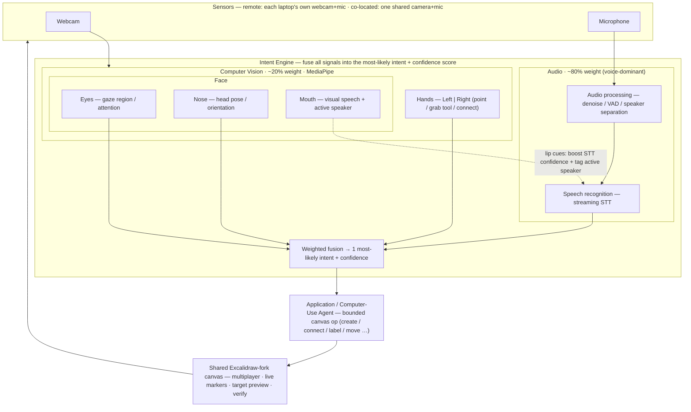

# Hands-Off — Project Planning Document

**A real-time, multimodal collaborative canvas — design systems together by speaking (primary), pointing/gesturing, and looking, on a forked, agent-aware Excalidraw.**

> **Deliverable 01 (D01)** for the Gauntlet AI capstone — our team's plan: the problem, the technical approach, the scope, and who owns what.

- **Team:** Jason Dijols, Naama Paulemont, Hirom Alarcon, Alexander Gouyet (4 challengers)
- **Direction:** A — Combine classical ML/CV with LLM applications
- **Date / version:** 2026-06-17 · v2.1 (canvas pivot + whiteboard architecture)
- **Deadline:** Wed Jun 17, 11:59 PM (D01) · live demo Mon Jun 29 (D02)
- **Repos:** `HandsOff` (this repo — fork of `excalidraw/excalidraw`) · `HandsOff-Knowledge` (team research & decisions)

---

## 1. Executive Summary

AI engineers think in systems — architectures, agent pipelines, user flows — and the
fastest way to align a team on one is to **draw it together**. At a physical whiteboard
that is effortless: everyone has a marker, ideas go up at the same time, and you point
and talk as you build. Digital canvas tools (FigJam, Miro, Excalidraw) move the
whiteboard online but lose what made it work — each person is funneled through a single
mouse and keyboard, so simultaneous co-creation collapses into slow, one-at-a-time
drag-and-drop. **Hands-Off gives every participant a high-bandwidth, mostly hands-free
"digital marker":** they **talk** to the canvas while **pointing/gesturing** to say
*where* and *which*, with the face (gaze, head pose, and lip movement) sharpening both.
We build on a **fork of Excalidraw** (open-source, embeddable, already multiplayer-ready)
and add an **Intent Engine** that fuses these signals — weighted **voice-dominant
(~80%) over vision (~20%)** — into the single most-likely, bounded canvas operation,
executed by an **application/computer-use agent** with a confidence score and a
pre-commit preview. The classical-CV/ML half (MediaPipe hands + face) and the
speech half (audio processing → streaming STT, with **mouth/lip cues boosting
recognition confidence**) are the Direction-A pairing: each does what it is best at.
**"Working" on Jun 29** means two people, on two machines, co-building one labeled
system diagram live on the shared canvas — grabbing tools, creating, connecting, and
labeling nodes by speaking and pointing, seeing each other's markers in real time —
with the **north-star** (and stretch) being a single camera that sees a whole co-located
team and separates *who said what* so four people drive one canvas at once.

## 2. Problem

### 2.1 The scenario (a concrete moment)

Two engineers, remote, are designing an authentication service. One says "let's whiteboard
it" and opens a shared canvas. Now the friction starts. Person A drives the mouse: drags a
rectangle, double-clicks to type "Auth Service," drags an arrow, fights the auto-snap.
Person B watches a cursor move — they have ideas *right now* ("no, the token store should
hang off the gateway"), but there is one effective point of control, so they wait, or they
narrate and let A translate, or they grab control and A waits. The thing they could do in
five seconds at a real whiteboard — both reach in, both draw, both talk over the same
picture — takes minutes of polite turn-taking. By the time the diagram exists, the
conversation has moved on, and the artifact is already behind the thinking. Worse, it now
lives as a static export in a README that nobody updates and the team's coding agents
can't meaningfully read.

### 2.2 Who has this problem (ICP)

**AI engineers** — people building with Cursor, Claude Code, Codex, and custom agents, who
constantly externalize **system designs, agent/data flows, and user flows** to align with
teammates (and, increasingly, with agents). They reach for diagrams more than most
developers because their work *is* architecture and orchestration. They are an
**early-adopter beachhead**, not the mainstream developer — which is a strength for an
ambition-graded capstone ("build for where the puck is going"). We pick this user, not
"all knowledge workers," because their diagrams are frequent, structural, and shared, and
because they already live in the AI-native tools that make a multimodal canvas feel
natural rather than gimmicky.

### 2.3 Why it matters / cost of the status quo

The cost is **serialization**. A physical whiteboard is inherently parallel — N people, N
markers, simultaneous input. Every digital canvas re-introduces a single serial pointer
per person and, in practice, one effective editor at a time during active design. That
turns the highest-bandwidth medium engineers have for communicating a system into the
**slowest and most serialized to produce together**:

- **Co-creation degrades to turn-taking** — the live, overlapping ideation that makes
  whiteboarding valuable is exactly what one-pointer-per-person kills.
- **Ideas decay before they're captured** — the diagram lags the conversation, so detail
  is lost.
- **Artifacts go stale and opaque** — the result is a static picture in a doc that drifts
  from reality and that agents can't read or act on.

### 2.4 Why now / why us

**Why now:** AI-native engineering is mainstream-enough to define a real ICP (most
professional developers now use AI tools), and that work is unusually diagram-heavy —
architectures and agent flows that teams must align on quickly. Commodity webcams plus
real-time CV (MediaPipe) and few-hundred-millisecond streaming STT (AssemblyAI) make
parallel multimodal input finally cheap and fast enough to feel like a marker, not a lab
demo.

**Why us / our wedge:** This is "Put-That-There" (Bolt, 1980) made real for collaborative
diagramming — **gaze and a point supply the referent instantly; voice supplies the intent;
an LLM keeps the action bounded.** Existing tools force a choice we eliminate: a mouse is
precise but serial and one-per-person; voice-only tools can't reliably bind "this / there"
to a target; computer-use agents can act but start from text and infer the target. We give
each participant a *parallel, natural* input channel so many people can address the same
canvas at once. Differentiation vs. the field — the computer-use-agent landscape, Clicky,
and Hey-Clicky-style voice desktop agents — is detailed in our team research
(`HandsOff-Knowledge`).

## 3. Goals & Non-Goals

- **Goals (the floor — must be true by demo day):**
  1. Two participants, on two machines, co-edit **one shared canvas in real time** on our
     **Excalidraw fork**, each with their own multimodal marker (live presence: each sees
     the other's cursor/gaze).
  2. **Voice-dominant** control: grab a tool, create, **connect**, and **label** nodes by
     *speaking* what you want while *pointing/gesturing* to say where ("grab a box, put it
     *there*, call it Auth Service," "connect *this* to the database"). Voice carries the
     intent (~80%); hands/face carry the spatial referent (~20%).
  3. A **dictation dialog** lets a participant talk to a canvas agent that creates/edits
     nodes (the application/computer-use agent that executes the fused intent).
  4. A **target preview + confidence score** shows what "this / there" resolved to *before*
     the op commits (trust + Midas-touch avoidance).
  5. **Honest feedback** — the system shows success/failure of each op; it never pretends
     an edit landed that didn't.
- **Stretch (the ceiling, in priority order):**
  1. **Co-located multi-person on one camera** — a single machine identifies up to ~4
     people in the room and uses **voice separation (diarization) + active-speaker mouth
     cues** to attribute each command/gesture to the right person, so a whole team drives
     one canvas at once. *(This is the north-star; we architect for it, demo it if stable.)*
  2. **Audio-visual STT** — lip-movement cues from face tracking measurably raise STT
     confidence in noisy/overlapping-speech conditions.
  3. 3+ concurrent remote users · an **agent participant** that reads and adds to the
     canvas · a voice "clean this up / auto-layout" command.
- **Non-goals (explicitly out of v1):** a complete gesture vocabulary · pixel-perfect gaze
  selection · replacing mouse/keyboard entirely (it stays as a fallback) · production-scale
  multiplayer/persistence/auth · rebuilding a canvas from scratch (we fork Excalidraw,
  not reinvent it).
- **Success metrics (user-visible):** op success rate (intended op executed) · target-binding
  accuracy (right element/region) · STT word accuracy with vs. without lip cues · speaker
  attribution accuracy (multi-person) · end-to-end latency per op (intent→render) · number
  of concurrent live editors · recovery rate after a wrong target.

## 4. Technical Approach

### 4.1 Architecture overview

The system has two top-level components (per the team whiteboard): an **Intent Engine**
that turns raw webcam + mic signals into *the single most-likely intent* with a
**confidence score**, and an **Application / Computer-Use Agent** that executes that intent
as a bounded operation on the shared canvas. Inside the Intent Engine, two subsystems run
in parallel and are then fused with a **voice-dominant weighting (~80% audio / ~20% CV)**:

- **Computer Vision (~20%)** — MediaPipe extracts **Hands** (left & right, individually:
  point / grab a tool / connect) and the **Face**, broken into **Eyes** (gaze region +
  attention), **Nose** (head pose / orientation), and **Mouth** (visual-speech + active-speaker).
- **Audio (~80%, voice-dominant)** — **Audio processing** (denoise / VAD / — for the
  co-located case — speaker separation) feeds **Speech Recognition** (streaming STT).
- **The mouth → speech link** — lip-movement cues from the Mouth tracker feed the speech
  path to **raise STT confidence** and, with multiple people on one camera, **attribute the
  utterance to the active speaker**.



**Core flow:** (1) MediaPipe turns each webcam into hand landmarks + a face breakdown
(eyes→gaze, nose→head pose, mouth→lip motion); (2) audio processing cleans the mic signal
and streaming STT turns speech into text, with **lip cues raising recognition confidence**
and tagging *who* is speaking; (3) the Intent Engine **fuses where (hand point refined by
gaze region) + what (voice) + who (user / active speaker)** with voice-dominant weighting
into **one schema-validated canvas op + a confidence score**; (4) the application/computer-use
agent applies the op to the shared Excalidraw-fork state and broadcasts to all clients;
(5) a **target preview** before commit + a readback after confirm what happened. Weights
are a *default prior*, not hard-coded — fusion scales each modality by its live confidence.

### 4.2 The hard problems

- **Reference binding ("this / there") on a busy shared canvas** → hand point supplies the
  precise referent, gaze narrows the region, voice names the action; always render a
  *target preview* before commit.
- **Voice-dominant multimodal fusion under uncertainty** → combine a high-weight voice
  channel with lower-weight, noisy hand/gaze/head signals into one bounded op + a confidence
  score; act immediately above a threshold, confirm below it. Weights are confidence-scaled,
  not fixed, so a crisp point can outvote a mumbled command and vice-versa.
- **Audio-visual speech (the mouth→speech link)** → lip-movement cues from the face tracker
  improve STT in noisy / overlapping-speech conditions (audio-visual ASR is a well-established
  gain) and drive **active-speaker detection** — both are why the Mouth box wires into the
  speech path on the whiteboard.
- **Speaker separation for one-camera, many-people (the north-star)** → in the co-located
  case, diarization on the audio plus active-speaker mouth cues attribute each command and
  gesture to the right person, so four people can drive one canvas without their inputs
  colliding. Grounded in our own voice research (ECAPA-TDNN speaker embeddings; AssemblyAI
  speaker labels).
- **Real-time multi-user concurrency** → many people editing one canvas without clobbering
  each other; lean on Excalidraw's multiplayer model (CRDT/Yjs-style scene sync) with
  per-user identity on every op.
- **Latency budget (feel like a marker)** → target ~300–500ms intent→render; stream
  landmarks/transcripts, run CV locally, never round-trip screenshots.
- **Midas touch (intent vs. idle)** → an explicit engage gesture and/or push-to-talk / wake
  word so casual motion and chatter don't mutate the canvas.
- **Forking vs. building the canvas** → we fork Excalidraw to inherit shapes, arrows,
  multiplayer, and export for free, and spend our effort on the input layer + a tweaked UI
  (toolbox-by-voice/gesture, a dictation dialog) rather than re-implementing a canvas.

### 4.3 Stack & key decisions

| Layer | Choice | Why | Reference (team KB) |
| --- | --- | --- | --- |
| Canvas + collaboration | **Fork of Excalidraw** (+ its multiplayer scene sync) | open-source, embeddable, multiplayer-ready, familiar shapes/arrows/export; we own the UI and add our input layer | new ADR (see §7) |
| Canvas agent / dictation | LLM behind a **dictation dialog** + schema-validated op grammar | "talk to the canvas" creates/edits nodes; the application/computer-use agent that runs the fused intent | new ADR |
| Hand tracking | MediaPipe Hand Landmarker | real-time landmarks/handedness from commodity webcam; left/right tracked individually | `hand-gesture-technologies`, `pointing-accuracy-approaches` |
| Face tracking | MediaPipe Face Landmarker (iris + lips) | one webcam yields eyes (gaze), nose (head pose), and mouth (lip cues) | `eye-gaze-technologies` |
| Speech-to-text | AssemblyAI streaming | few-hundred-ms realtime transcription, voice-agent oriented | `voice-dictation-technologies` |
| Audio processing / separation | VAD + denoise; **speaker diarization** (AssemblyAI labels / ECAPA-TDNN embeddings) | clean the voice channel; attribute speech in the co-located multi-person case | `voice-dictation-technologies`, `handsoff-architecture-master` |
| Audio-visual fusion | mouth-cue → STT confidence + active-speaker | raise recognition accuracy and bind utterance↔person | `handsoff-architecture-master` |
| Intent engine | weighted fusion (voice-dominant) → bounded op + confidence | turn fused where+what+who into one safe canvas op | new ADR |
| Knowledge graph | `HandsOff-Knowledge` repo | source of truth for why/what/decisions | `0001-knowledge-base-architecture` |

### 4.4 Data, flows & schemas

Two message types move through the system: a **canvas op** (a committed, bounded edit, the
output of the Intent Engine) and a lightweight **presence/marker** broadcast (so everyone
sees everyone's marker live).

```json
// canvas op — output of the Intent Engine (voice-dominant fusion)
{
  "user_id": "alex",
  "speaker_id": "alex",            // who spoke (diarization / active-speaker; == user_id in remote mode)
  "op": "grab_tool | create_node | move | connect | label | group | delete | annotate",
  "target": { "type": "element | region | point", "ref": "el_123 | [x,y] | null",
              "resolved_by": "voice+hand+gaze" },
  "args": { "text": "Auth Service", "to": "el_456", "shape": "rect" },
  "modalities": {
    "voice": { "transcript": "connect this to the database", "conf": 0.95, "weight": 0.80 },
    "hand":  { "point": [x,y], "gesture": "point", "conf": 0.93, "weight": 0.14 },
    "gaze":  { "region": [x,y,w,h], "conf": 0.71, "weight": 0.04 },
    "head":  { "yaw_pitch": [y,p], "conf": 0.66, "weight": 0.02 },
    "mouth": { "lip_active": true, "stt_conf_boost": 0.06 }   // audio-visual + active-speaker
  },
  "confidence": 0.86,              // calibrated, confidence-scaled fusion of the above
  "confirmation_required": false,  // true when confidence < threshold or op is destructive
  "ts": 1718600000
}
```

```json
// presence/marker — high-frequency, not persisted
{ "user_id": "alex", "cursor": [x,y], "gaze_region": [x,y,w,h], "gesture": "idle", "speaking": false, "ts": 1718600000 }
```

Verification happens in the agent/execution layer: an op is only reported successful after
the canvas state actually changed; otherwise the user gets a visible failure (no silent
success).

## 5. Scope & Staged Plan

### 5.1 MVP demo slice (what must work on Jun 29)

**Two people, two laptops, one shared canvas (our Excalidraw fork), built live.** Each
participant *speaks* to drive the canvas while *pointing/gesturing* to say where; both see
each other's markers and edits in real time; the system previews each target + confidence
before committing and reports honest success/failure. One rehearsed end-to-end moment:
*the two of them co-build a small labeled architecture diagram (e.g. client → gateway →
auth service → token store) in under a minute* — **grab the rectangle tool by gesture,
dictate "Auth Service" into it, point at it and say "connect this to the token store,"**
talking and pointing at the same time. Scope shape: **architect for N users / one-camera
many-people, demo reliably with 2 remote.** If diarization + active-speaker are stable by
demo week, show the **stretch**: one camera, two+ people co-located, voice-separated.

### 5.2 Stages

| Stage | Name | Deliverable (done = demonstrable) | Owner |
| --- | --- | --- | --- |
| 1 | Fork Excalidraw + multiplayer foundation | forked canvas runs; one shared scene, presence, two live markers; toolbox reachable programmatically | Naama |
| 2 | Shared CV runtime + hand gesture | MediaPipe pipeline emits left/right point / grab-tool / connect events | Hirom (runtime) + Jason (hand) |
| 3 | Face runtime (eyes + nose + mouth) | emits gaze region (eyes), head pose (nose), and lip-activity / active-speaker signal (mouth) | Alexander |
| 4 | Voice path + audio-visual confidence | AssemblyAI streaming transcript → command grammar; mouth lip-cues raise STT confidence | Naama (voice) + Alexander (mouth-cue link) |
| 5 | Intent Engine (voice-dominant fusion) | weighted where+what+who → previewed, bounded canvas op + confidence score | Hirom |
| 6 | Integrate + verify + demo | end-to-end 2-user flow incl. grab→dictate→connect + readback/honest failure + recording | All |
| 7 (stretch) | One-camera multi-person separation | diarization + active-speaker attribute commands/gestures to ≥2 co-located people | Naama (diarization) + Alexander (active-speaker) |

### 5.3 Timeline / checkpoints

- **Wed Jun 17, 11:59 PM** — D01 Planning Document due (this doc). Hard deadline.
- **Mon Jun 29** — D02 live 10-minute presentation + demo.
- **Internal milestones:** by **Jun 21** stages 1–3 standing locally; by **Jun 25** stage 4–5
  fused single-user; by **Jun 27** two-user integration; **Jun 28** demo rehearsal + recording.

## 6. Team & Ownership

Ownership leans on who researched each input lane. One **accountable** owner per component;
support roles noted. ⚠️ **Confirm with the team before submit** — and note the load balance
call-out below.

| Workstream | Owner *(accountable)* | Support | Scope | Done when |
| --- | --- | --- | --- | --- |
| Project lead / delivery & demo | Naama | — | scope coherence, unblock, demo readiness | prioritized board + rehearsed demo path exist |
| Product framing / interaction design | Jason | — | ICP, whiteboard problem story, gesture+gaze+voice vocabulary, demo narrative, KB hygiene | team can explain who / why / how-it-feels |
| Hand-gesture input | Jason | Hirom (CV runtime) | point / grab / connect semantics from hand landmarks | stable hand-driven canvas ops |
| Face input (eyes/nose/mouth) + audio-visual link | Alexander | Hirom (CV runtime), Naama (voice) | gaze region, head pose, mouth lip-cues → STT confidence + active-speaker | gaze narrows target; mouth cues boost STT + tag speaker |
| Voice / STT + speaker separation | Naama | Alexander (active-speaker) | AssemblyAI streaming, command grammar, failure states; diarization for multi-person | speech → reliable command text at demo latency; speakers separated (stretch) |
| Intent Engine + shared CV runtime | Hirom | Jason, Alex, Naama | MediaPipe runtime shared by hand+face; voice-dominant weighted fusion of where+what+who → bounded op + confidence + preview | fused intent yields a previewed, bounded op |
| Canvas (Excalidraw fork) + multiplayer + execution + dictation dialog | Naama | Hirom | fork Excalidraw, presence, concurrent edits, apply ops, dictation-to-agent UI | two users co-edit one canvas; ops execute + verify |
| Market / positioning | Alexander | — | whiteboard/canvas-collab landscape, why-now/why-us, FigJam/Miro/Excalidraw differentiation | defensible positioning section exists |

> ⚠️ **Load-balance call-out (resolve before submit):** Naama is currently accountable for
> *project lead + voice + canvas/execution* — the heaviest lane. Options: (a) move the
> multiplayer-canvas foundation to a Naama+Hirom pair with Hirom accountable, or (b) shift
> project-lead duties to Jason. Pick one before submit so no one is overloaded.

## 7. Risks & Open Questions

| Risk / open question | Why it matters | Mitigation / owner |
| --- | --- | --- |
| Webcam gaze accuracy is coarse | core to target binding | gaze = region only, hand = precision; spike — Alexander |
| Real-time multi-user conflict | the whole value prop is simultaneity | CRDT/multiplayer (Yjs/Liveblocks); spike — Naama |
| Multimodal fusion ambiguity (hand vs. voice disagree) | wrong edits erode trust | confidence threshold + target preview + confirm-below-threshold — Hirom |
| End-to-end latency in the live loop | must feel like a marker | local CV, streaming STT, no screenshots; budget ~300–500ms — Hirom |
| Midas touch (unintended input) | casual motion/chatter mutates canvas | engage gesture + push-to-talk wake — Jason |
| Multi-camera / multi-machine demo logistics | two real machines (or one shared camera) on stage | rehearse on the actual hardware by Jun 27 — Naama |
| **Excalidraw fork + multiplayer effort** | foundational stack; getting the fork building + scene-sync wired is on the critical path | spike the fork + multiplayer + a programmatic op by Jun 19, write ADR — Naama |
| **Audio-visual STT integration** | the mouth→speech confidence link is novel and could under-deliver | treat lip-cue boost as additive/optional; STT must work standalone first — Alexander |
| **Speaker separation accuracy (one-camera, many-people)** | the north-star stretch hinges on it; mis-attribution erodes trust | demo with 2 remote as the floor; gate the co-located demo on a diarization+active-speaker spike — Naama/Alexander |
| **No external research yet on canvas-collab pain** | §2 grounding is thinner than the old desktop-drift case | add 2–3 citations on remote-collab/whiteboarding friction — Jason |
| Owner load balance not finalized | gates execution | **resolve before submit** — team |

## 8. Deliverables & Definition of Done

| Deliverable | Requirement / DoD | Owner |
| --- | --- | --- |
| D01 Planning Document | this doc, submitted by Jun 17 11:59 PM | Jason |
| D02 Live presentation (10 min) | live 2-user co-editing demo + learnings, Jun 29 | Naama |
| Code repo (`HandsOff`) | setup guide, architecture overview, runnable 2-user demo | Naama |
| Knowledge graph | research, ADRs, tickets linked in `HandsOff-Knowledge` | Jason |
| Demo recording / artifacts | session capture proving simultaneous co-edit + verification | Alexander |

## 9. Tickets / Issues

| Ticket | Owner | User-visible outcome | Depends on | Acceptance criteria |
| --- | --- | --- | --- | --- |
| Define demo slice + success metrics | Jason | team knows exactly what must work | this doc | flows + cut scope + metrics written down |
| Fork Excalidraw + multiplayer + op spike + ADR | Naama | foundational canvas runs; one op applied programmatically | this doc | fork builds; 2-client scene sync; ADR by Jun 19 |
| Multiplayer canvas foundation (on the fork) | Naama | two users see one canvas with live markers | fork ADR | 2 cursors + concurrent edits sync without clobber |
| Shared CV runtime | Hirom | per-user hand+face landmarks stream locally | webcam | emits hand landmarks/handedness + face (eyes/nose/mouth) + confidence + ts |
| Hand-gesture semantics | Jason | point / grab-tool / connect events drive ops | CV runtime | stable gesture → event mapping with confidence |
| Face runtime (eyes/nose/mouth) | Alexander | gaze region + head pose + lip-activity emitted | CV runtime | gaze region pre-filters targets; mouth emits active-speaker/lip signal |
| Voice command path | Naama | spoken command → transcript to planner | mic/API | final text + timing + error states |
| Audio-visual STT confidence (mouth→speech) | Alexander | lip cues raise STT confidence | voice path + face runtime | measurable confidence/accuracy delta with vs. without lip cues |
| Dictation dialog + canvas agent | Naama (UI) + Hirom (agent) | talk to the canvas to create/edit nodes | fork + intent engine | dialog dictates → agent emits a valid canvas op |
| Intent Engine (voice-dominant fusion) | Hirom | weighted where+what+who → bounded canvas op | CV + face + voice | schema-valid op + confidence + target preview |
| Execution + verification | Naama | op applies to canvas; success only when confirmed | intent engine + canvas | readback + success/fail + visible error |
| One-camera multi-person separation (stretch) | Naama (diarization) + Alexander (active-speaker) | ≥2 co-located people attributed correctly | voice path + face runtime | diarization + mouth cues bind utterance/gesture → right person |
| Market positioning note | Alexander | team explains why-now / why-us / why-not-existing | computer-use-agents landscape, Clicky | one note compares user, wedge, competitors, differentiation |

## 10. Appendix — Planning Checklist

- **Constraints:** ICP locked (AI engineers)? success metrics defined? non-goals explicit? ✅
- **Architecture:** every component choice has a one-line justification + ADR path? ✅ (Excalidraw-fork ADR pending)
- **Scope:** MVP slice is a demonstrable end-to-end 2-user flow, not a feature list? ✅
- **Ownership:** every workstream has exactly one accountable owner (confirm + load balance)? ⚠️
- **Risk:** top risks each have a spike or an owner? ✅
- **Demo:** one rehearsed flow that proves simultaneous multimodal co-editing? ✅

## Supporting research

The detailed research, decisions, and citations behind this plan live in the team's
`HandsOff-Knowledge` repo (Obsidian vault). Key notes:

- Prior desktop-control planning doc (superseded by this canvas direction)
- Planning-doc outline & template
- Gauntlet capstone brief · capstone proposal · proposal v2 alignment
- Hand-gesture technologies · pointing-accuracy approaches
- Eye-gaze technologies · voice-dictation technologies
- Computer-use agents landscape · Clicky · Hey-Clicky voice desktop agent
